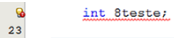

# Tópicos

[O que são tipos primitivos](#o-que-são-tipos-primitivos)

[Declaração e inicialização de variáveis](#declaração-e-inicialização-de-variáveis)

[Escopo de variável](#escopo-de-variável)

[Estrutura de controle]

[Estrutura de repetição]

[Estrutura de seleção]

# INTRODUÇÃO

Caro(a) aluno(a), nesta unidade iremos compreender alguns dos elementos
básicos da linguagem Java. Abordaremos os aspectos fundamentais das palavraschaves, tipos primitivos, variáveis e escopo de variáveis, que são responsáveis
por informar como acessar uma variável de outra classe. 

Também abordaremos estruturas de controle, repetição e seleção. Essas estruturas de controle são uma parte-chave de quase toda linguagem de programação
e a linguagem Java oferece várias maneiras de executá-las. Algumas, como as
instruções if e for, são comuns à maioria as linguagens. 

Para a implementação de todos os exemplos, usaremos a plataforma de
desenvolvimento NetBeans IDE e a ferramenta Astah Community para realizar
todas as modelagens UML de nosso projeto. A UML (Unified Modeling Language
- Linguagem de Modelagem Unificada) é uma linguagem visual utilizada para
modelar sistemas computacionais orientados a objeto. Neste trabalho, faremos
uso do diagrama de atividades que apresenta muita semelhança com fluxogramas utilizados para desenvolver a lógica de programação e determinar o fluxo
de controle de um algoritmo. 

> Fonte: Oliveira, J. Estruturas Básicas da Linguagem Java. In: CESAR, T. **Programação Avançada**. 1.ed.rv. Maringa, PR: Centro Universiário de Maringá, 2018. p. 07-08

# O QUE SÃO TIPOS PRIMITIVOS?

Toda a linguagem de programação possui uma maneira de tratar os dados que
serão manipulados em um sistema. Para tanto, esses dados devem ser armazenados em tipos de dados que correspondam ao seu valor.

Definir um tipo de dado mais adequado para ser armazenado em uma variável é uma questão de grande importância para garantir a resolução do problema.
Ao desenvolver um algoritmo, é necessário que se tenha conhecimento prévio
do tipo de informação (dado) que será utilizado para resolver o problema proposto. Daí escolhe-se o tipo adequado para a variável que representará esse valor. 

Há oito tipos de dados primitivos em Java e vamos compreender um pouco
mais sobre cada um a seguir.

## TIPOS INTEIROS

Os tipos inteiros são para números sem partes fracionárias. Valores negativos
são permitidos. O Java fornece os quatro tipos de números inteiros mostrado
na tabela abaixo:


Na maioria das situações, o tipo int é o mais prático. Os tipos byte e short são
essencialmente utilizados para aplicativos especializados, como tratamento
de arquivo de baixo nível, ou para grandes arrays quando há pouco espaço de
armazenamento.

O tipo long deve ser identificado com a letra “L” para não ser “compactado”
pela linguagem em um tipo inteiro. A compactação ocorre como uma maneira
de reduzir o uso de memória.

## TIPOS DE PONTO FLUTUANTE


O nome double refere-se ao fato de que esses números são duas vezes mais precisos do que o tipo float. As únicas razões para utilizar float são aquelas raras
situações em que o processamento é importante ou quando você precisa armazenar um grande número deles. Números do tipo float têm sufixo “F” (por exemplo,
3.454F). Números de ponto flutuante sem um sufixo F sempre são considerados
como o tipo double. Opcionalmente, você pode fornecer o sufixo “D” (3.22D).

## O TIPO CHAR

O tipo char é utilizado para descrever caracteres individuais. Por exemplo ‘A’ é
um caractere de constante com um valor 65. Ele é diferente de “A”, uma string
que contém um único caractere. 


## O TIPO BOOLEAN


> Fonte: Oliveira, J. Estruturas Básicas da Linguagem Java. In: CESAR, T. **Programação Avançada**. 1.ed.rv. Maringa, PR: Centro Universiário de Maringá, 2018. p. 33-36

# DECLARAÇÃO E INICIALIZAÇÃO DE VARIÁVEIS

## DECLARAÇÃO DE VARIÁVEIS

Java é uma linguagem de programação **fortemente tipada**. Isto significa que
cada variável deve ter um tipo de dado associado a ela. Por exemplo, uma variável pode ser declarada para usar um dos oito tipos de dados primitivos: byte,
short, int, long, float, double, char ou boolean, que são os tipos primitivos que
vimos anteriormente. 

O nome de uma variável pode começar com uma letra, um sublinhado “_”,
ou cifrão $. Se o nome da variável começar com um sublinhado, o segundo
caractere deve ser uma letra alfabética. Veja, abaixo, alguns exemplos de declarações de variáveis.


O nome não pode começar com um dígito (0, 1, 2, 3, 4, 5, 6, 7, 8 ou 9). Veja, a
seguir, um exemplo de tentativa de declaração de uma variável iniciando com
dígito. 



Observe que o NetBeans IDE destacou o nome incorreto de variável. 

Depois do primeiro caractere, o nome da variável pode incluir letras, dígitos (0, 1, 2, 3, 4, 5, 6, 7, 8 ou 9) ou sublinhados, em qualquer combinação. O
nome de uma variável também não pode ser nenhuma das palavras-chaves da
linguagem Java. As palavras-chaves são palavras especiais, reservadas em Java.
Elas têm um significado para o compilador que as usa para determinar o que
seu código-fonte está tentando fazer. Veja no quadro abaixo a lista das 49 palavras-chaves reservadas.


## INICIALIZANDO VARIÁVEIS

Antes de uma variável ser utilizada, ela deve receber um valor inicial. Isto é
chamado de inicialização de variável. Se tentar usar uma variável sem antes a
inicializar, como no exemplo abaixo, ocorrerá um erro:


O compilador irá lançar um erro informando que a variável número não pode
ser inicializada. 

Para inicializar uma variável, usamos uma instrução de atribuição. Uma
instrução de atribuição segue o mesmo padrão de uma equação de matemática (por exemplo, a equação 2 + 2 = 4). Para dar um valor à variável, o lado
esquerdo tem de ser o nome da variável e o lado direito o valor atribuído, conforme figura abaixo:


No exemplo acima, o número foi declarado com um tipo de dados int e foi inicializado com 0 (zero). Podemos agora adicionar 5 para a variável número, pois
ela já foi inicializada:


Tipicamente, a inicialização de uma variável é feita ao mesmo tempo que a sua
declaração:


> Fonte: Oliveira, J. Estruturas Básicas da Linguagem Java. In: CESAR, T. **Programação Avançada**. 1.ed.rv. Maringa, PR: Centro Universiário de Maringá, 2018. p. 36-39

# ESCOPO DE VARIÁVEL 

Muitos erros de compilação são gerados porque os programadores não possuem
uma imagem clara de quanto tempo as variáveis estão disponíveis e quando elas
podem ser acessadas. O conceito escopo de variável descreve a vida de uma variável, ou seja, refere-se à acessibilidade de uma variável. É a parte do programa
em que o nome da variável pode ser referenciado. Você pode declarar variável em vários lugares diferentes do mesmo código. Abaixo serão listados vários
escopos de variável para que você possa compreender mais sobre esse assunto
tão importante.

## VARIÁVEIS DE INSTÂNCIA (ATRIBUTOS)

As variáveis de instâncias são definidas dentro da classe, mas fora de qualquer
método, e só são inicializadas quando a classe é instanciada. Elas são os campos que pertencem a cada objeto. Por exemplo, o código abaixo define campos
(variáveis de instância) para a classe Livro.


A classe Livro do código anterior informa que cada instância sua terá seu próprio preço, quantidade e tipo. Em outras palavras, cada instância poderá ter seus
próprios valores exclusivos para esses três campos. 

## VARIÁVEIS LOCAIS

As variáveis locais são as declaradas dentro de um método. Da mesma forma
que a variável local inicia sua existência dentro do método, ela também é eliminada quando a execução do método é concluída. Não há palavra-chave especial
que designa uma variável como local; a determinação vem inteiramente a partir do local em que a variável é declarada - que é entre as chaves de abertura e
fechamento do método.

As variáveis locais só são visíveis para os métodos em que são declaradas,
não são acessíveis a partir do resto da classe. Por isso elas não utilizam a maioria dos modificadores e acessos como public, abstract, static etc., porém ela pode
fazer uso do modificador final.

A variável local precisa ser inicializada para ser usada. A sintaxe para declarar uma variável local e inicializá-la é semelhante ao declarar um campo. Veja
na imagem abaixo um exemplo de variável local.


Observe que a variável contador foi declarada dentro do método metodoContar(). E ela foi inicializada na mesma linha onde foi declarada. O compilador
rejeitará qualquer tentativa de utilização de uma variável a qual não tenha sido
atribuído um valor, porque – diferente das variáveis de instância – as variáveis
locais não recebem valores padrão. 

A variável contador do exemplo acima não pode ser referenciada em nenhum
código externo ao método onde foi declarada. Para compreendermos mais, vamos
analisar a figura a seguir:


Observe que no segundo método imprimir() a variável contador foi destacada
pelo NetBeans IDE acusando um erro de acesso. 

## VARIÁVEIS DE CLASSE (ESTÁTICAS)

Variáveis de classe, também conhecidas como variáveis estáticas, são declaradas
com a palavra-chave static em uma classe, mas fora de um método construtor
ou um bloco. O modificador static diz ao compilador que há apenas uma cópia
de cada variável de classe por classe, independentemente de quantos objetos são
criados a partir dele.

A ideia por trás do conceito de variável estática é a de que objetos de uma
mesma classe podem e, em algumas situações, devem compartilhar valores em
comum, caso contrário, teríamos de criar atributos que precisariam ser atualizados todos ao mesmo tempo, e em cada objeto criado.

Vejamos o seguinte exemplo: um sistema de venda de livros possui um desconto que é ajustado regularmente de acordo com a infl ação e repassado a todas
as vendas de livros do sistema, quando tivermos de fazer um ajuste ou atualizar
o valor do desconto, teríamos de fazê-lo em todos os livros cadastrados. Porém,
se essa variável não “pertencer” aos objetos, e sim à própria classe, todos os livros
saberão do novo desconto, pois se baseiam no mesmo valor. Observe na fi gura
a seguir o exemplo de um código com a variável static. 


Neste caso, a variável quando é estática funciona mais ou menos como uma variável do tipo global em linguagens como Pascal ou Delphi. Embora no Java não
exista um conceito de variável global, este caso seria talvez o que teríamos mais
próximo disto.

Então quando a classe é criada, a variável DESCONTO é inicializada com
20 e na chamada do método vender() ela é calculada gerando assim um novo
valor para o livro.

## COMPARANDO OS ESCOPOS DE VARIÁVEL

A tabela abaixo apresenta uma comparação resumida entre os escopos de variável vistos anteriormente e os principais pontos que devem ser lembrados.


> Fonte: Oliveira, J. Estruturas Básicas da Linguagem Java. In: CESAR, T. **Programação Avançada**. 1.ed.rv. Maringa, PR: Centro Universiário de Maringá, 2018. p. 39-43


# ESTRUTURAS DE CONTROLE

Leia um valor X;
Calcule Y como função de X: Y = X * 2;
Imprima o resultado

Estruturas de controle são instruções que permitem que blocos específicos de
código sejam escolhidos para serem executados, redirecionando determinadas
partes do fluxo do programa. O Java contém três tipos de estruturas de controle:
instruções de sequência; instrução de seleção (if, if else, switch) e instruções de
repetição (while, do-while, for). 

# INSTRUÇÕES DE SEQUÊNCIA


# ESTRUTURAS DE SELEÇÃO

## INSTRUÇÕES IF E ELSE

```java
if (expressão){
 diretiva
}
```


```java
if (expressão){
    Diretiva 1
} else {
    Diretiva 2
}
```


## ARGUMENTOS VÁLIDOS PARA INSTRUÇÕES IF 

Podemos fazer uso de
operadores lógicos && (and), || (or) e ! (not)


# INSTRUÇÕES SWITCH

```java
switch (expressão ordinal) {
    case valor ordinal 1:
        diretiva 1;
        break;
    case valor ordinal 2:
        diretiva 2;
    break;
...
    default:
        diretiva N;
}
```


Nesse programa vamos ler do teclado um caractere numérico utilizando a classe
Scanner do Java. A classe Scanner é uma das diversas classes do Java que permite
a leitura de dados vindos do teclado. A utilização do método nextint() da classe
Scanner deixa no buffer a instrução da tecla pressionada. 


É importante observar que nos comandos case da
instrução switch só são aceitas variáveis do tipo int, char, byte, short.

# ESTRUTURAS DE REPETIÇÃO

## USANDO LOOP FOR

```java
for ([início]; [condição]; [inc/dec]){
    diretiva;
}
```


para i de 1 até 10 faça
    Escreva i
fim_para

Em Java, pode-se usar para fazer repetição condicional:


Podemos efetuar múltiplas diretivas na inicialização e no incremento, se necessário, separando com vírgulas:


## USANDO LOOP WHILE

```java
while (condição)
{
    Diretiva;
}
```


## USANDO LOOP DO-WHILE


```java
do {
    diretiva;
} while (condição);
```


# DESVIOS INCONDICIONAIS

## Break


Note que mesmo que a condição for instruísse para que o programa imprimisse números até o 500, a condição if se tornou válida quando o cont chegou
ao número 6, e sendo verdadeiro, executou seu bloco de instrução interrompendo o programa


Note que o programa não imprimiu os números 5, 6 e 7 devido à execução do
comando continue.

## BREAK E CONTINUE ROTULADOS

Tanto a instrução break quanto continue podem ser não rotuladas ou rotuladas.
As rotuladas serão necessárias somente nas situações em que você tiver um loop
aninhado e precisar indicar qual quer encerrar ou a partir de qual deseja continuar a próxima interação. Uma instrução break sairá do loop rotulado e não do
loop atual se a palavra-chave break for combinada com um rótulo. Um exemplo
do formato de um rótulo se encontra no código a seguir:


Nesse exemplo, a sentença “Dentro do Loop” será exibida uma vez. Em seguida,
a instrução break rotulada será executada e o fluxo sairá do loop rotulado com o
rótulo que declaramos “externo”. Então, a próxima linha de código exibirá “Fora
do Programa”.

Vejamos o que acontecerá se a instrução continue for usada em
vez de break:


Nesse exemplo, a sentença “Dentro do Loop” foi executada 2 vezes atendendo
a condição de y < 3. Depois de concluída essa instrução, o programa imprimiu
13 vezes a sentença “Fora do Loop”. Para concluir, quando a condição do loop
externo for avaliada como falsa, o loop i será encerrado e a sentença “Fora do
Programa” será exibida

## BREAK E CONTINUE NÃO ROTULADOS

As instruções break e continue não rotuladas saíram da estrutura do loop atual e
prosseguirão na linha de código posterior ao bloco do loop. O exemplo abaixo
demonstra uma instrução break.


