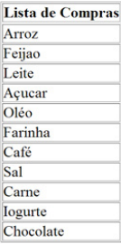

# Tópicos

[O que é JSP](#oque-é-jsp)

[O que é JSF](#o-que-é-jsf)

[Criando um projeto com JSF](#criando-um-projeto-com-jsf)

[Managed Beans](#managed-beans)

[Tabelas no JSF](#tabelas-no-jsf)

[Principais Tags do JSF](#principais-tags-do-jsf)

[JSF - Facelets Tags](#jsf--facelets-tags)

[Utilizando Facelets para criar templates](#utilizando-facelets-para-criar-templates)

[Validação com JSF](#validação-com-jsf)

[Exibição de Mensagens](#exibição-de-mensagens)

[Considerações Finais](#considerações-finais)

# Oque é JSP

**Java Server Pages (JSP)** é uma tecnologia para desenvolvimento de 
páginas web que suportam conteúdo dinâmico e possibilita aos 
desenvolvedores inserir código Java em páginas HTML ou XHTML, fazendo 
uso de tags especiais JSP que começam com **<% e terminam com %>**.

**Usando JSP**, você pode coletar a entrada de usuários por meio de 
formulários de páginas web, apresentar registros de um banco de dados 
ou de outra fonte e criar páginas web de forma dinâmica.

Com o JSP é possível incorporar a linguagem Java à sua aplicação web. 
Você pode usar todas as APIs e construção de blocos em Java em sua 
página JSP, incluindo fazer declarações, decisões, loops etc.

O bloco **if ... else** começa como um Scriptlet comum, mas o Scriptlet é 
fechado em cada linha de texto com HTML.

# O que é JSF

O Java Server Faces (JSF) é um framework de componentes do lado do servidor 
para a construção de aplicações web baseadas em tecnologia Java. JSF consiste em 
uma API para representar componentes de gerenciamento de estado, manipulação 
de eventos, validação do lado do servidor, conversão de dados e definição de 
navegação de página, apoiando a internacionalização, acessibilidade, e fornecendo 
extensibilidade para todos esses recursos.

JSF possui bibliotecas de tags para a adição de componentes para páginas web e 
para conectar componentes a objetos do lado do servidor. O JSF fornece um 
modelo de programação bem definido e várias bibliotecas de tags. Essas 
características facilitam significativamente a construção e manutenção de 
aplicações web com interfaces de usuário do lado do servidor (UIs).

O JSF é baseado no Model View Controller (MVC), arquitetura para separar a lógica 
de apresentação. O MVC é um padrão de arquitetura que tem por objetivo isolar a 
lógica de negócio da lógica de apresentação de uma aplicação.

O **padrão MVC** divide uma aplicação em três tipos de componentes: modelo, visão 
e controlador.

**Modelo**: encapsula os dados e as funcionalidades da aplicação.
**Visão**: é responsável pela exibição de informações, cujos dados são obtidos do 
modelo.
**Controlador**: recebe as requisições do usuário e aciona o modelo e/ou a visão

# Criando um projeto com JSF

Utilize o assistente Projeto do NetBeans IDE para criar um nova aplicação Java
Web. Para isso, clique no botão Novo Projeto da barra de ferramentas principal
do NetBeans. Quando chegar na Etapa 4: Frameworks, selecione JavaServer Faces.


O projeto será criado com os arquivos web.xml na pasta WEB-INF. A configuração do Servlet do JSF será adicionada ao web.xml. Caso queira alterar a página
principal do projeto, é necessário editar o arquivo web.xml a fim de acertar a
configuração do JSF e definir a página padrão do projeto. Vamos configurar a
navegação seguindo os passos abaixo:

1. No projeto criado do NetBeans IDE, clique com o botão direito sobre
Páginas Web > Novo > XHTML

2. Nomeie o novo arquivo XHTML para login e clique em finalizar.

Observe que o NetBeans IDE criou um novo arquivo chamado login.xhtml em
páginas Web. Agora vamos editar o web.xml que se localiza na pasta WEB-INF
e alterar a seguinte linha destacada em negrito no código abaixo.

[Arquivo web.xml](WEB-INF/web.xml)

Edite o arquivo login.xhtml e altere o texto para o código abaixo:

```xhtml
<html xmlns=”http://www.w3.org/1999/xhtml”>
 <head>
 <title>Tela de Login</title>
 </head>
 <body>
 <div>Essa é a Tela de Login</div>
 </body>
</html>
```

Ao executar o projeto, o JSF irá consultar o arquivo de configuração web.xml
e direcionar a primeira página para login.xhtml, e não mais para index.xhtml.
Esse recurso é muito importante quando necessitamos criar aplicações que precisam seguir determinados fluxos de páginas. Execute o projeto e visualize o
resultado abaixo

# Managed Beans

Os Managed Beans são objetos utilizados nas aplicações JSF e possuem três responsabilidades principais:

1. Receber os dados enviados pelos usuários por meio das telas da aplicação.
   
2. Executar as lógicas para tratar as requisições dos usuários.
   
3. Disponibilizar os dados que devem ser apresentados nas telas da aplicação.
   
Para definir o funcionamento de um Managed Bean no JSF 2, devemos seguir
os seguintes passos:

1. Criar uma classe com a anotação @ManagedBean.
   
2. Definir atributos com os correspondentes getters e setters para poder receber dados das telas ou enviar dados para as telas.
   
3. Definir métodos para implementar as lógicas de tratamento das possíveis requisições dos usuários

## ANOTAÇÕES DE ESCOPO


Anotações de escopo definem o escopo em que o managed bean será colocado. Se
o escopo não for especificado, o managed bean utilizará o padrão que é o request
scope. Cada escopo é brevemente discutido abaixo.


### EXEMPLO DE APLICAÇÃO

1. Crie um novo projeto no NetBeans IDE. Selecione a categoria Java Web
e selecione o projeto Aplicação Web

2. Nomeie o Projeto para Exemplo1JSF.

3. Selecione o servidor Tomcat.

4. Em Frameworks, selecione o JavaServer Faces e clique em finalizar.
   
Em pacotes de código, crie um pacote chamado escola e dentro crie uma classe
chamada Nota, e implemente o código abaixo:

[Nota](escola/nota.jsp)

Observe no código da classe Nota que fazemos uso da notação @ManagedBean
do pacote javax.faces.bean.ManagedBean e nomeamos o nosso bean como notaBean. Como nosso bean foi nomeado, teremos de utilizar o nome do bean no
nosso xhtml.

Abaixo vamos implementar o código da tela de entrada para que o usuário
possa inserir os parâmetros necessários para que a soma seja executada. 

```xhtml
<html xmlns=”http://www.w3.org/1999/xhtml”
 xmlns:h=”http://java.sun.com/jsf/html”>
 <h:head>
 <title>Exemplo 1 JSF</title>
 </h:head>
 <h:body>
 <h:form>
 <h:panelGrid>
 <h:outputLabel value=”Digite a Nota 1”/>
 <h:inputText value=”#{notaBean.nota1}”/>
 <h:outputLabel value=”Digite a Nota 2”/>
 <h:inputText value=”#{notaBean.nota2}”/>
 <h:commandButton action=”#{notaBean.somar()}” value=”Gerar
Resultado” />
 <h:outputText value=”#{notaBean.resultado}”/>
 </h:panelGrid>
 </h:form>
 </h:body>
</html>
```

Observe que só foi possível a utilização dos componentes visuais do JSF, pois o
mesmo foi importado por meio da notação xmlns:h=”http://java.sun.com/jsf/
html”.

O componente h:panelGrid é utilizado para organizar outros componentes
em tabelas de uma forma prática, já o componente visual h:outputLabel, para criar
um rótulo para o campo no qual deve ser digitado a nota1 e nota 2. Utilizamos
também o componente visual h:inputText para criar o campo da nota1 e nota2.
Para criar o botão, fizemos uso do componente h:commandButton, que por meio
da ação action faz a chamada em nosso bean do método proposto. Para visualizar o resultado, fizemos uso do h:outputText o qual traz o atributo resultado
do nosso notaBean. 

Agora que já implementamos o código, execute o projeto e observe a saída
do nosso programa na figura abaixo:


# Tabelas no JSF

A criação de tabelas se dá utilizando o componente h:dataTable com dados de
alguma coleção. Vamos criar um novo projeto para visualizar o funcionamento
do componente h:dataTable.

1. Crie um novo projeto Web no NetBeans IDE chamado compras e selecione o Framework JavaServer Faces.
   
2. Crie uma classe chamada ListaCompras e a defina no pacote compras.
   
3. Adicione o código abaixo na classe ListaCompras.

```java
package compra;
import java.util.ArrayList;
import java.util.List;
import javax.faces.bean.ManagedBean;
@ManagedBean(name = “listaBean”)
public class ListaCompras {
 private List<String> itens = new ArrayList<String>();
 public ListaCompras() {
 this.itens.add(“Arroz”);
 this.itens.add(“Feijao”);
 this.itens.add(“Leite”);
 this.itens.add(“Açucar”);
 this.itens.add(“Oléo”);
 this.itens.add(“Farinha”);
 this.itens.add(“Café”);
 this.itens.add(“Sal”);
 this.itens.add(“Carne”);
 this.itens.add(“Iogurte”);
 this.itens.add(“Chocolate”);
 }
 public List<String> getItens() {
 return itens;
 }
 public void setItens(List<String> itens) {
 this.itens = itens;
 }
}
```

4. No arquivo index.xhtml, adicione o código abaixo:

```xhtml
<?xml version=’1.0’ encoding=’UTF-8’ ?>
<!DOCTYPE html PUBLIC “-//W3C//DTD XHTML 1.0 Transitional//EN”
“http://www.w3.org/TR/xhtml1/DTD/xhtml1-transitional.dtd”>
<html xmlns=”http://www.w3.org/1999/xhtml”
 xmlns:f=”http://java.sun.com/jsf/core”
 xmlns:h=”http://java.sun.com/jsf/html”>
 <h:head>
 <title>Lista de Compras JSF</title>
 </h:head>
 <h:body>
 <h:dataTable value=”#{listaBean.itens}” var=”lista” bor
der=”1”>
 <h:column>
 <f:facet name=”header”>
 <h:outputText value=”Lista de Compras”></h:outputText>
 </f:facet>
 <h:outputText value=”#{lista}”></h:outputText>
 </h:column>
 </h:dataTable>
 </h:body>
</html>
```

Observe que o componente h:dataTable utiliza o atributo var=“lista”, que indica

o objeto que será apresentado em nossa lista.
Execute o projeto e veja a tabela com a lista de compras:



# Principais tags do JSF

JSF fornece uma biblioteca de tags HTML padrão. Essas tags são renderizadas
na saída html correspondente. Nessas tags se faz necessário usar os seguintes
namespaces no nó html

```html
<html
 xmlns=”http://www.w3.org/1999/xhtml”
 xmlns:h=”http://java.sun.com/jsf/html”
>
```

Podemos também fazer uso de outros componentes visuais como o RichFaces, cujo
site oficial pode ser visitado por meio da url <http://www.jboss.org/richfaces>,
ou o Primefaces, que pode ser visitado por meio da url <http://www.primefaces.org>. Tanto o Richfaces como o Primefaces são um conjunto de componentes
open source leve para Java Server Faces 2.0. Eles são ricos em componentes JSF
e podem ser adquiridos por meio das respectivas urls citadas acima.

Porém, não devemos deixar nossos olhos nos enganarem. Os componentes
visuais do JSF vão além da questão visual. Esses componentes podem ser reaproveitados em diversos pontos da mesma aplicação ou em aplicações diferentes,
mostrando de forma concreta o poder da Orientação a Objetos e o desenvolvimento Orientado a Componentes.
Abaixo a lista das principais tags do JSF:


As tags iniciadas por f: são validadores embutidos para validar seus componentes de interface do usuário. Essas tags podem validar comprimento do campo, o
tipo da entrada e um objeto personalizado.

Para essas tags, você precisa usar os seguintes namespaces da URI no nó html.

```html
<html
 xmlns=”http://www.w3.org/1999/xhtml”
 xmlns:f=”http://java.sun.com/jsf/core”
>
```
# JSF – FACELETS TAGS

JSF fornece tags especiais para criar um layout comum para uma aplicação web,
chamadas de tags Facelets. Essas tags fornecem flexibilidade para gerir as partes
comuns de várias páginas em um só lugar.

Para essas, tags você precisa usar os seguintes namespaces da URI no nó html.

```html
<html
 xmlns=”http://www.w3.org/1999/xhtml”
 xmlns:ui=”http://java.sun.com/jsf/facelets”
>
```

Abaixo, a lista das principais tags do Facelets:


# UTILIZANDO FACELETS PARA CRIAR TEMPLATES

A reutilização do código das telas é realizada principalmente pelo uso de templates. A criação de um template é simples, basta criar um arquivo xhtml adicionando
todos os componentes visuais que são fixos e devem aparecer em um determinado conjunto de telas.

Para os trechos dinâmicos, devemos aplicar o componente ui:insert criando
um espaço que pode ser preenchido depois. Veja um exemplo abaixo de um template criado com Facelets.

```html
<html xmlns=”http://www.w3.org/1999/xhtml”
 xmlns:h=”http://java.sun.com/jsf/html”
 xmlns:ui=”http://java.sun.com/jsf/facelets”>
 <h:head>
 <title>Template JSF</title>
 </h:head>
 <h:body>
 <div id=”header”>
 LOGO - Banner
 <hr />
 </div>
 <ui:insert name=”conteudo”> Espaço para o conteúdo da tela
</ui:insert>
 <div id=”footer” style=”text-align: center”>
 <hr />
 RODAPE - Todos os direitos reservados
 </div>
 </h:body>
</html>
```

A saída desse template é a seguinte: 


O atributo name do componente ui:insert é utilizado para identificar o espaço
que será preenchido depois. Após escrever o template, devemos criar as telas que
o utilizarão. Essas telas são definidas também por meio de arquivos xhtml. Para
indicar que desejamos utilizar um template, devemos aplicar o componente ui:-
composition. Para preencher um espaço deixado no template, devemos inserir
o componente ui:define no código.

```jsp
<?xml version=”1.0” encoding=”UTF-8”?>
<!--
To change this template, choose Tools | Templates
and open the template in the editor.
-->
<!DOCTYPE html>
<html xmlns=”http://www.w3.org/1999/xhtml”
 xmlns:h=”http://java.sun.com/jsf/html”
 xmlns:ui=”http://java.sun.com/jsf/facelets”>
 <ui:composition template=”/template.xhtml”>
 <ui:define name=”conteudo”>
 <h:outputText value=”Conteúdo da página
 personalizado. Aqui será implementado
 todo o conteudo dessa página”/>
 </ui:define>
 </ui:composition>
</html>
```

A saída do projeto após a execução foi a seguinte: 


# VALIDAÇÃO COM JSF

O JSF define validadores padrões para serem aplicados nos dados obtidos dos
usuários. Um dos validadores mais utilizados é o required, que verifica se um
determinado campo não deixou de ser preenchido

```jsp
<h:inputText value=”#{managedbean.nome}” id=”campo-nome” required=”true”/>
 <h:message for=”campo-nome”/>
```

# Exibição de Mensagens

Para adicionar nas telas erros relacionados a um determinado campo, devemos utilizar a componente h:message. Primeiro, temos que definir um id para o
campo desejado. Depois, associar o h:message a esse id. Observe o exemplo baixo:

1. Crie um novo projeto web chamado MensagemErro e selecione o
Framework JavaServer Faces.

2. Crie uma classe chamada Mensagem com o seguinte código: 
   
```java
import javax.faces.bean.ManagedBean;
@ManagedBean(name = “mensagemBean”)
 public class Mensagem {
 private int nota;
 public int getNota() {
 return nota;
 }
 public void setNota(int nota) {
 this.nota = nota;
 }
 
```

3. Digite o seguinte código no arquivo index.xhtml: 

```jsp
<?xml version=’1.0’ encoding=’UTF-8’ ?>
<!DOCTYPE html PUBLIC “-//W3C//DTD XHTML 1.0 Transitional//EN”
“http://www.w3.org/TR/xhtml1/DTD/xhtml1-transitional.dtd”>
<html xmlns=”http://www.w3.org/1999/xhtml”
 xmlns:h=”http://java.sun.com/jsf/html”>
 <h:head>
 <title>Mensagem de Erro JSF</title>
 </h:head>
 <h:body>
 <h:form>
 <h:inputText
 value=”#{mensagemBean.nota}” id=”campo-nota”/>
 <h:commandButton value=”Enviar”/>
 <hr/>
 <h:message for=”campo-nota”/>
 </h:form>
 </h:body>
</html>
```

Observe que o h:messages está utilizando o atributo for que valida a informação
do id=“campo-nota” na tag h:inputText.

Ao executar, obtemos o seguinte erro:


As mensagens de erro podem ser personalizadas no seu managedBean. 

# Considerações Finais

Esta unidade abordou os fundamentos da linguagem Server-side JSP, assim como a 
maneira de criar páginas web dinâmicas de forma prática e simples. Apresentamos 
também o JavaServer Faces – JSF, que é uma especificação JEE que padroniza um 
framework MVC voltado para o desenvolvimento de aplicações Web.

O JSF foi um acontecimento natural da evolução do modelo de desenvolvimento de 
aplicativos web. A grande vantagem prometida por meio do JSF é que a 
especificação seria utilizada como referência para propiciar o venerado “ambiente 
de desenvolvimento rápido” tanto na camada visão como no lado do servidor.

Conhecer o mínimo de qualquer tecnologia é muito importante. Implementar e configurar um projeto web faz parte do aprendizado, independente da
IDE utilizada. Para se tornar um bom desenvolvedor JSP ou JSF, é necessário
ter bons conhecimentos nos fundamentos do framework e nos fundamentos sobre desenvolvimento web.