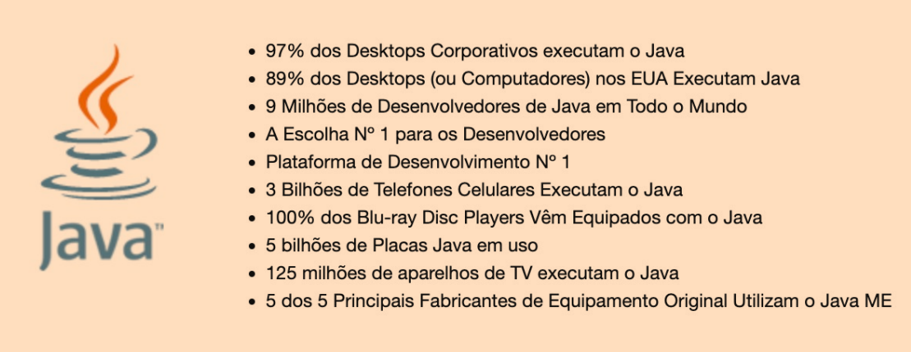
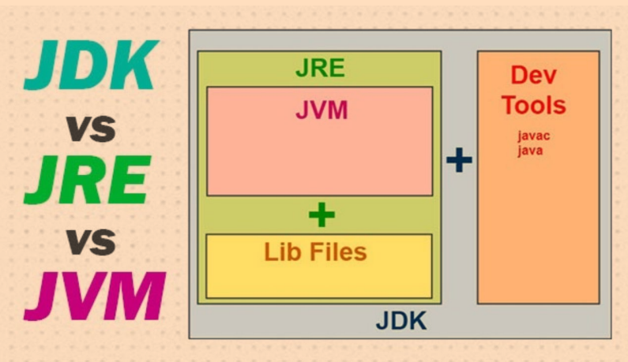
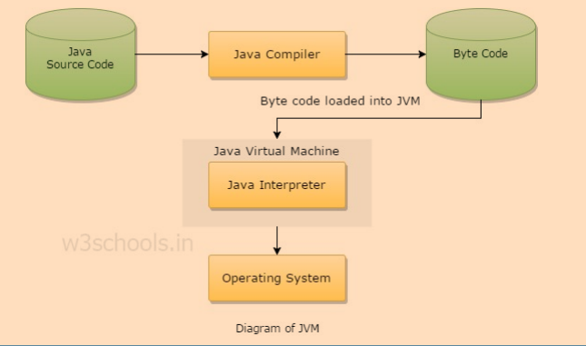

# Tópicos
[Apresentação](#Apresentação)

[Introdução](#INTRODUÇÃO)

[Histórico Java](#HISTÓRICO-E-EVOLUÇÃO-DA-LINGUAGEM-JAVA)

[A Tecnologia Java](#A-TECNOLOGIA-JAVA)

[Compilação, Interpretação de Programas Java](#O-PROCESSO-DE-COMPILAÇÃO-E-INTERPRETAÇÃO-DE-PROGRAMAS-JAVA)

# Apresentação

Na **Unidade I**, teremos a apresentação da história e evolução da linguagem Java, desde
as suas primeiras versões, em que só existia a linguagem Java puramente e algumas
poucas bibliotecas disponíveis. Além disso, será apresentada a tecnologia Java onde
a linguagem Java está inserida atualmente e as principais bibliotecas disponíveis para
cada plataforma Java de desenvolvimento. O processo de compilação e interpretação
de programas Java é apresentado, destacando cada fase e os elementos necessários
para que um programa Java possa ser executado.

A **Unidade II** abordará as estruturas básicas de um programa em Java, como: tipos
primitivos, declaração e inicialização de variáveis e escopo de variáveis. Estruturas de controle, repetição e seleção serão apresentadas para permitir que programas Java
possam ser executados de forma a terem fluxos de informações diferentes em momentos diferentes de sua execução. Para tanto, estruturas como if, do-while e switch
podem ser usadas.

Na **Unidade III** você entenderá a diferença entre classes e objetos Java. Você verá
que uma classe Java serve como um modelo para que os objetos (instâncias) daquela classe possam ser criados e permitir que o programa Java tenha “vida”. Mas
para entender esses conceitos, serão apresentados os principais elementos que
compõem uma classe Java: atributos, métodos, construtores, e o método main.
A Unidade IV abordará os conceitos básicos sobre Servlets, permitindo o desenvolvimento Web. O ciclo de vida de servlets, hierarquia de classes e a implementação
dos principais métodos também foram apresentados.

Por fim, na **Unidade V** serão apresentados como criar páginas Web dinâmicas com
JSP e como utilizarmos elementos de interfaces gráficas mais dinâmicas e flexíveis
por meio de JSF.

Lembre-se sempre que programar é uma “arte moderna” em que aquele que detém
o maior poder de abstração possível é aquele que melhor saberá desenvolver os
seus programas.

> Fonte: Oliveira, J. Introdução. In: CESAR, T. **Programação Avançada**. 1.ed.rv. Maringa, PR: Centro Universiário de Maringá, 2018. p. 07-08

# INTRODUÇÃO

Caro(a) aluno(a), nesta primeira unidade trataremos alguns conceitos relacionados à linguagem Java que serão fundamentais para o entendimento das demais
unidades.

A tecnologia Java, formada pela linguagem Java mais todas as bibliotecas disponíveis para download e uso, tem sido responsável por grande parte do mercado
de desenvolvimento de software comercial e acadêmico nas últimas duas décadas. Empresas de médio e grande porte vêm adotando tal tecnologia com base
em seus poderosos recursos e características. Java é uma linguagem baseada no
paradigma de orientação a objetos, o que facilita a manutenção de sistemas Java
quando os princípios básicos de tal paradigma são seguidos

> Fonte: Oliveira, J. Introdução. In: CESAR, T. **Programação Avançada**. 1.ed.rv. Maringa, PR: Centro Universiário de Maringá, 2018. p. 15



# HISTÓRICO E EVOLUÇÃO DA LINGUAGEM JAVA

A linguagem Java foi criada por James
Gosling em 1992.

A **primeira versão estável** da linguagem Java foi o **JDK** (Java Development
Kit) 1.0.2, conhecido por **Java 1**, em
janeiro de 1996 com o codinome Oak.
Em fevereiro de 1997, foram adicionadas algumas bibliotecas, como: eventos
com base na biblioteca Abstract Window
Toolkit (AWT), classes internas, conexão
com banco de dados via Java Database
Connectivity (JDBC) e invocação remota de métodos.

Em dezembro de 1998, foi lançada a **J2SE 1.2** (Java Standard Edition), codinome **playground** e conhecida simplesmente como Java 2. Esta foi a evolução
mais significativa da linguagem Java, já que a tecnologia foi dividida em três
principais plataformas: **J2SE** (Java 2 Standard Edition), **J2EE** (Java 2 Enterprise
Edition) e **J2ME** (Java 2 Micro Edition).

Ao **J2SE** foram adicionadas as seguintes bibliotecas: Swing para interface
gráfica com o cliente, coleções (List, Set e Map), e a possibilidade de criação de
pontos flutuantes de acordo com o padrão IEEE 754.

Em maio de 2000, foi lançada a versão **1.3**, codinome **Kestrel**. As mudanças
mais notáveis foram: invocação remota de método compatível com CORBA, introdução das bibliotecas JavaSound para tratamento de sons e JNDI (Java Naming
and Directory Interface) para o compartilhamento de recursos.

Em fevereiro de 2002, foi lançada a versão **1.4 da J2SE**, codinome **Merlin**,
que foi a primeira versão desenvolvida sob a tutela da Java Community Process
(JCP). A **JCP1**
é uma comunidade extremamente importante formada por um
consórcio de empresas que regulamenta a tecnologia Java de forma geral. Dentre
as maiores melhorias, destacam-se: a inclusão de expressões regulares, capacidade de lidar com o protocolo iPv6, biblioteca para Logging, integração parsers XML,
melhoria nas bibliotecas para criptografia e segurança

Em setembro de 2004 foi lançada a versão **J2SE 5.0**, codinome **Tiger**, conhecida como Java 5. Várias mudanças significativas foram incorporadas nesta nova
versão, dentre elas: biblioteca para Generics, eliminando a necessidade de conversões entre tipos similares, inclusão de uma biblioteca para metadados de uma
aplicação, autoboxing/unboxing, que são conversões automáticas entre tipos primitivos, enumerations, que permitem criar listas de valores ordenados, e a melhoria
da estrutura de repetição for para coleções e arrays

Em dezembro de 2006, foi lançada a versão Java **SE 6**, codinome **Mustang**,
conhecida como **Java 6**. A partir desta versão, as siglas J2SE, J2EE e J2ME foram
substituídas pelas siglas **Java SE**, **Java EE** e **Java ME**, respectivamente. Dentre as
melhorias, podemos citar: aumento de desempenho da plataforma básica, suporte
ao JDBC 4.0, uma biblioteca dedicada somente ao compilador Java e melhorias
no desempenho e segurança da máquina virtual Java

Em julho de 2011, foi lançada a versão Java SE 7, codinome **Dolphin**, conhecida como **Java 7**. Algumas características adicionadas a esta versão: estrutura
de seleção switch aceitando strings, e não somente valores inteiros, nova biblioteca para tratar entrada e saída e melhorias nos streams para XML e Unicode

Atualmente o **Java SE** se encontra na versão **8** com novas funcionalidades,
sendo a principal delas: segurança e correção de vários bugs existentes na versão anterior. 

> Fonte: Oliveira, J. Introdução. In: CESAR, T. **Programação Avançada**. 1.ed.rv. Maringa, PR: Centro Universiário de Maringá, 2018. p. 16-17

# A TECNOLOGIA JAVA

O Java é composto por uma série de
vários produtos de software e especificações provenientes, originalmente,
da *Sun Microsystems*, e hoje sobre
responsabilidade da Oracle. Esses
produtos juntos fornecem um sistema para o desenvolvimento e a
implantação de softwares em ambientes computacionais multiplataforma.

O Java é usado em uma ampla
variedade de plataformas computacionais, desde sistemas embarcados e telefones celulares até servidores
empresariais e supercomputadores. Menos comum, porém ainda usados, estão
os Java applets que de vez em quando são utilizados para melhorar a segurança
de navegadores Web e computadores de mesa, conhecidos como desktops.

Escrever usando a linguagem de programação Java é a principal forma de
produzir o código que será implantado na forma de **bytecodes Java**. Existem,
ainda, os compiladores de bytecodes disponíveis para gerar código para outras linguagens como Ada, JavaScript, Python e Ruby. Várias novas linguagens de programação foram projetadas para serem executadas de forma nativa na máquina
virtual Java (Java Virtual Machine - JVM), que veremos na seção “A Máquina
Virtual Java”, como Scala, Clojure e Groovy. A sintaxe de Java é muito semelhante
à de C e C + +, porém mais recursos orientados a objetos podem ser modelados.

O Java elimina algumas construções de baixo nível, como ponteiros, além
de possuir um modelo de memória muito simples, em que cada objeto é alocado em uma pilha e todas as variáveis de tipos de objeto são referências. O seu
gerenciamento de memória é feito por meio da coleta de lixo (**Garbage Collector**)
automática realizada pela JVM.

Uma edição da “**plataforma Java**” é o nome de um pacote de programas relacionados que permite o desenvolvimento e a execução de programas escritos em
Java. A plataforma não é específica para qualquer processador ou sistema operacional. Porém, a sua execução requer uma JVM e um compilador com um
conjunto de bibliotecas que são implementadas para diversos hardwares e sistemas operacionais para que os programas em Java possam ser executados de forma
idêntica em qualquer ambiente. As seguintes plataformas Java são as mais comuns:

- **Java Card** – uma tecnologia que permite pequenas aplicações baseadas em Java
(applets) para serem executadas em cartões inteligentes com segurança e
similares de memória em pequenos dispositivos.

-  **Java ME (Micro Edition)** – especifica vários conjuntos diferentes de
bibliotecas (conhecidos como perfis) para dispositivos com armazenamento, exibição e capacidade de energia limitados. Muitas vezes usado
para desenvolver aplicativos para dispositivos móveis, PDAs, set-top boxes
de TV e impressoras.

- **Java SE (Standard Edition)** – para uso geral em aplicações, desktops, servidores e dispositivos similares.

- **Java EE (Enterprise Edition)** – é a soma da plataforma Java SE com as
mais diversas outras APIs úteis para aplicações multicamadas e clienteservidor em empresas.

A plataforma Java consiste de vários programas. Cada programa fornece uma
parcela de suas capacidades gerais. Por exemplo, o compilador Java, que converte código-fonte Java em bytecode Java (uma linguagem intermediária para a **JVM**), é
fornecido como parte do Java Development Kit (**JDK**). O Java Runtime Environment
(**JRE**) complementa a JVM com um compilador just-in-time (JIT), que **converte bytecodes** intermediários no código de máquina nativo da plataforma alvo. Um extenso conjunto de bibliotecas também forma a plataforma Java

Assim, os componentes essenciais da plataforma Java são: o compilador
Java, as bibliotecas e o ambiente de tempo de execução em que o bytecode Java
intermediário “executa” de acordo com as regras estabelecidas na especificação
da máquina virtual.

O coração da plataforma Java é a máquina virtual, que executa programas
de bytecode Java. Este código é o mesmo, não importa em que sistema operacional ou hardware o programa está sendo executado. O compilador JIT traduz
o bytecode Java em instruções do processador nativo em tempo de execução e
armazena o código nativo em memória durante a execução.

O uso do bytecode como linguagem intermediária permite que os programas Java possam rodar em qualquer plataforma que tenha uma máquina virtual
disponível. O uso de um compilador JIT permite que aplicações Java, depois de
um pequeno atraso durante o carregamento e uma vez “prontas”, tendam a ser
executadas tão rápido como os programas nativos. Desde a versão 1.2 da JRE,
a implementação de Java incluiu um compilador just-in-time, em vez de um
interpretador.




Embora os programas Java sejam multiplataforma ou independente de plataforma, o código da máquina virtual em que estes programas rodam não é. Cada
plataforma operacional possui a sua própria JVM.

Em muitos sistemas operacionais modernos, um conjunto extenso de código
reutilizável é fornecido para simplificar o trabalho do programador. Normalmente,
esse código é fornecido como um conjunto de bibliotecas carregáveis dinamicamente, em tempo de execução. Como a Plataforma Java não é dependente de
qualquer sistema operacional específico, os aplicativos não podem confiar em
qualquer biblioteca de sistema operacional pré-existente. Em vez disso, a plataforma Java fornece um conjunto amplo de suas próprias bibliotecas-padrão
contendo, grande parte, as mesmas funções reutilizáveis comumente encontradas em sistemas operacionais modernos. A maior parte do sistema de bibliotecas
também é escrita em Java. Por exemplo, biblioteca Swing desenha a interface do
usuário e controla os eventos em si, eliminando muitas diferenças sutis entre
diferentes plataformas, como lidar com componentes semelhantes.

As bibliotecas Java servem a dois propósitos principais. Primeiro, assim como
outras bibliotecas de código-padrão, as bibliotecas Java fornecem ao programador um conjunto bem conhecido de funções para realizar tarefas comuns, como
a manutenção de listas de itens ou a análise de uma String complexa. Segundo, as
bibliotecas de classe fornecem uma interface abstrata para tarefas que normalmente dependem fortemente dos sistemas de hardware e operacional. Tarefas
como acesso à rede e acesso a arquivos estão muitas vezes fortemente entrelaçadas com as implementações distintas de cada plataforma. As bibliotecas java.
net e java.io implementam uma camada de abstração em código nativo do sistema operacional, então fornecido para a interface padrão das aplicações Java.

De acordo com a Oracle, o JRE é encontrado em mais de 850 milhões de
computadores. A Microsoft não tem fornecido um JRE com seus sistemas operacionais desde que a Sun Microsystems processou a Microsoft por adicionar classes
específicas do Windows ao pacote do ambiente de execução Java.

Alguns aplicativos Java estão em uso em desktop, incluindo ambientes de
desenvolvimento integrados, como NetBeans e Eclipse, e os clientes de compartilhamento de arquivos como o Limewire e Vuze. O Java também é usado no
ambiente de programação matemática MATLAB para tornar a interface do usuário mais amigável. O Java fornece interface de usuário multiplataforma para
algumas aplicações, como o Lotus Notes.

> Fonte: Oliveira, J. Introdução. In: CESAR, T. **Programação Avançada**. 1.ed.rv. Maringa, PR: Centro Universiário de Maringá, 2018. p. 18-21

# O PROCESSO DE COMPILAÇÃO E INTERPRETAÇÃO DE PROGRAMAS JAVA

O JDK inclui muitos utilitários para compilação, depuração e execução de aplicações Java



## O COMPILADOR JAVA

Uma aplicação Java deve ter pelo menos uma classe que contenha um método
chamado main(), o qual contém o primeiro código a ser executado para iniciar
a aplicação.
A classe, a seguir, é um bom exemplo, ela simplesmente mostra a frase “Olá,
Mundo!” na saída padrão, que neste caso é o console:

```java
public class OlaMundo {
    public static void main(String[] args) {
        System.out.println(“Olá, Mundo!”);
    }
}
```
O compilador Java simplesmente converte arquivos-fonte Java em bytecodes. O
uso do compilador Java é o seguinte:

```bash
javac [opções] [arquivo fonte]
```
A forma mais direta é como se segue:

```bash
javac OlaMundo.java
```
Isso resultará em um arquivo bytecode com o mesmo nome do arquivo .java,
mas com a extensão .class: OlaMundo.class. É possível, ainda, informar a pasta
de destino do bytecode com a opção –d. 

## O CLASSPATH

O Path (caminho em inglês) é uma variável de ambiente de um sistema operacional que fornece a uma aplicação uma lista de pastas onde procurar por algum
recurso específico.

O exemplo mais comum é o caminho para programas executáveis. **A variável de** **ambiente CLASSPATH de Java é uma lista** **de locais que são visitados na**
**procura por arquivos de classes.** Tanto o interpretador Java como o compilador
Java usa a CLASSPATH quando procura por pacotes e classes Java.

Um elemento de classpath pode ser uma pasta, um arquivo .JAR ou um
arquivo .ZIP. A forma exata de configurar a classpath varia de sistema para sistema. Em um sistema baseado no Unix (incluindo o Mac OS X), você pode
configurar a variável de ambiente CLASSPATH com uma lista de locais separados por dois pontos. Por exemplo:

```bash
% CLASSPATH=/home/ze/Java/classes:/home/maria/lib/foo.jar:.
% export CLASSPATH
```

Nesse exemplo, estamos especificando uma classpath com três locais: uma
pasta chamada classes, um arquivo .JAR e a pasta atual que é especificada com
um ponto.

No sistema Windows, a variável de ambiente CLASSPATH é configurada
com uma lista de locais separada por ponto e vírgula. Por exemplo:

```cmd
C:\> set CLASSPATH=D:\users\joao\Java\classes;E:\apps;
```

O inicializador Java e outras ferramentas de linha de comando sabem como
encontrar as classes essenciais, as quais são incluídas na instalação Java. As classes
nos pacotes java.lang, java.io, java.net, e java.swing, por exemplo, não precisam
ser incluídas na classpath.

Para encontrar outras classes, o compilador e o interpretador Java procuram
os elementos da classpath na ordem em que foram inseridos. A busca combina
os locais e os nomes dos pacotes das classes. Por exemplo, imagine a estrutura de
pacote e classe animais.passaros.Galinha. Procurar o local /usr/lib/java incluído
na classpath, significa procurar por /usr/lib/java/animais/passaros/Galinha.class.
Procurar pelo local /home/maria/classesuteis.jar incluído na classpath, significa
procurar pelo arquivo /home/maria/classesuteis.jar e dentro dele procurar pelo
arquivo compactado animais/passaros/Galinha.class.

Se você deseja compilar sua aplicação com pacotes e classes definidos por
você mesmo(a), terá que dizer à JVM onde procurar os pacotes e classes na classpath. Essa inclusão da informação de localização da classe na classpath é feita
dizendo ao compilador onde a classe ou pacote desejado estão com as opções
de linha de comando –cp ou –classpath.

Por exemplo:

```bash
javac –cp terceiros\classes;\home\maria\classesuteis.jar;. AloMundo.java

```
Essa linha de comando diz que além das classes core, qualquer classe ou
pacote que esteja nos locais citados na lista separada por ponto e vírgula pode
ser utilizado na compilação de AloMundo.java. 

Note que não é necessário incluir na classpath da compilação o local das classes core, como já foi dito, e também locais já definidos na variável de ambiente
CLASSPATH. 

Para conhecer outras opções do compilador javac, basta digitar javac –help
ou simplesmente javac sem nenhum complemento. Uma lista com as opções
será mostrada. 

## O INTERPRETADOR JAVA

A interpretação de arquivos bytecode Java é a base para a criação de aplicações Java.

A forma de utilizar o aplicativo java.exe para interpretar arquivos de bytecode (.class) é a seguinte:

```bash
java [-opções] nome_da_classe [argumentos]
```

## INTERPRETAÇÃO DO BYTECODE

O interpretador Java é chamado com o aplicativo java.exe (no Windows). Ele é
usado para interpretar o bytecode (arquivo .class) e executar o programa.

O nome da classe deve ser especificado de forma completa, incluindo pacotes, se houver. Alguns exemplos:

```bash
% java animais.passaros.Galinha
% java AloMundo
```

O interpretador procura pela classe na classpath. Por outro lado, você pode
querer definir onde se encontram certos pacotes ou classes que sejam importantes para a interpretação (como classes de apoio). Você pode encontrar pacotes
ou classes em tempo de execução incluindo a opção –cp ou –classpath com o
interpretador. A utilização é a mesma que no comando javac visto anteriormente.

O interpretador Java pode ser utilizado com a opção –jar para executar um
arquivo container .JAR. Por exemplo:

```bash
% java -jar batalhanaval.jar

```

Nesse caso, o arquivo .JAR se torna o classpath e a classe que contém o método
main() dentro dela é considerada o programa a ser executado. 

## A ASSINATURA DO MÉTODO MAIN()

O método main() deve possuir a assinatura de método correta. A assinatura de
um método é um conjunto de informações que define o método. Ela inclui o
nome do método, seus argumentos e o tipo de retorno, assim como o modificador de visibilidade e tipo. O método main() deve ser público (public), estático
(static) e receber um array de objetos Strings (textos, nesse caso sem espaço) e
não deve retornar valor indicando com a palavra reservada void. Assim:

```java
public static void main (String[] argumentos)

```

O fato de main() ser público e estático simplesmente significa que ele é acessível globalmente e que ele pode ser chamado diretamente pelo nome. Quem o
chama é o inicializador quando interpretamos o bytecode. 

O único argumento do método main() é um array de objetos Strings, que
serve para armazenar em cada entrada do array os parâmetros digitados pelo
usuário após o nome da classe a ser interpretada. O nome do parâmetro pode
ser escolhido pelo usuário (escolhemos “argumentos” no exemplo acima); mas
o tipo deve ser sempre String[], que significa array de objetos String

Se, por exemplo, interpretamos uma classe que aceita argumentos da seguinte
forma:

```java
java ClasseExemplo arroz feijão macarrão

```

Então teremos a primeira posição do array, argumentos[0] igual a “arroz”,
a segunda posição, argumentos[1] igual a “feijão” e a terceira posição do array,
argumentos[2] igual a “macarrão”. Repare que arrays têm sua indexação começada por zero. 

> Fonte: Oliveira, J. Introdução. In: CESAR, T. **Programação Avançada**. 1.ed.rv. Maringa, PR: Centro Universiário de Maringá, 2018. p. 22-26
